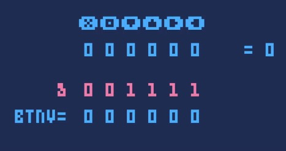

# Pico-8笔记

## 按键输入
我们都知道在pico-8中有两种检测按键输入的方式：btn() 和 btnp() 
这两个都是进行输入某一值的检测，然后返回true或false。
但是在pico-8中还存在另一种输入检测方式，就是获取btn()的值。

这里和之前的区别在于之前的使用需要btn(a),将要检测的按键a输入，而如果我们运行如下代码，会在当我们进行输入的时候返回一个值。
```lua
function _draw()
    print(btn()) 
end
```

大家可能第一时间联想到输出的值，应该是对应了按键输入的值，但是却不是。
输出的值是：将六个输入按键排列为二进制格式，按下为1，无按下为0，然后输出为十进制的值。
 X  O  ⬆️ ⬇️ ⬅️ ➡️
 0  0  0  0  0  0 = 0
知道了这个之后，可以找出所有的值和对应的按钮
L:left \ R:right \ U:up \ D:down
O \ X


0 - 无按下 
1 - L 
2 - R 
3 - L+R 
4 - U 
5 - L+U 
6 - R+U 
7 - L+U+R 
8 - D 
9 - L+D 
10 - R+D 
11 - L+D+R 
12 - U+D 
13 - L+U+D 
14 - R+U+D 
15 -U+D+L+R全部按下 
16 - O 
17 -O+L 
18 -O+R 
19 -O+L+R 
20 -O+U 
21 -O+L+U 
22 -O+R+U 
23 -O+L+R+U 
24 -O+D 
25 -O+L+D 
26 -O+R+D 
27 -O+L+R+D 
28 -O+U+D 
29 -O+U+D+L 
30 -O+U+D+R 
31 -O+L+R+U+D 
32 -X 
33 -X+L 
34 -X+R 
35 -X+L+R 
36 -X+D 
37 -X+L+D 
38 -X+R+D 
39 -X+L+R+U 
40 -X+D 
41 -X+D+L 
42 -X+D+R 
43 -X+D+L+R 
44 -X+U+D 
45 -X+U+D+L 
46 -X+U+D+R 
47 -X+U+D+L+R 
48 -O+X 
49 -O+X+L 
50 -O+X+R 
51 -O+X+L+R 
52 -O+X+U 
53 -O+X+U+L 
54 -O+X+U+R 
55 -O+X+U+L+R 
56 -O+X+D 
57 -O+X+D+L 
58 -O+X+D+R 
59 -O+X+D+L+R 
60 -O+X+U+D 
61 -O+X+U+D+L 
62 -O+X+U+D+R 
63 -O+X+U+D+L+R 
64 -menu 

要注意：这里只展示了pico-8的64个组合输出显示，picotron目前版本也只支持这些按键的组合输出。

所以 》= 64 都说明在按住其他键的同时，按下了menu按键。可以直接识别为menu按下

可以通过添加“与或”值的方式，进行遮罩。
只检测方向 
local btnv = btn()&0b1111

使用：按位与（&）进行运算
二进制0b1111，所以会剔除掉x和o按键输入



## mac系统运行多个pico-8

在终端中输入：
```
open -n -a PICO-8 --args -run /Users/wangyu/Library/Application Support/pico-8/carts/untitled.p8
```
确保路径正确，且有untitled.p8文件。将其作为打开的默认文件。

## 地图尺寸
长128个瓦片
高64个瓦片
但是后32个瓦片和精灵的第3-4页共享。
所以在使用所有的精灵页后，可使用的瓦片为
128x32(上半部分)

屏幕大小：16x16个瓦片（128x128，8x8的精灵）

所以以屏幕为一个单位划分，map128x32个瓦片有
一行8个屏幕一共两行，也就是16个屏幕

## 精灵大小对cpu的影响
在相同数量的情况下
较小的精灵所占用的cpu的使用率较小
例子：
绘制一千个8x8的精灵，占用99%cpu
绘制一千个4x4的精灵，占用34%cpu

## 按键快捷键
| 按键| 效果  |
|---|---|
|  F6 | 截取游戏画面为png |
|  F7 | 截取游戏画面作为标签说明 |
|  ctrl+8 | 开始录制gif |
|  ctrl+9 | 结束录制gif |
|  ctrl/Command+s | 保存游戏 |
|  ctrl/Command+r | 运行游戏 |
|  f | 在绘制精灵面板内，可以将图块内的精灵水平翻转 |
|  v | 在绘制精灵面板内，可以将图块内的精灵垂直翻转 |
|  ctrl+f | 搜索当前代码框的字母或单词 |
|ctrl+f|搜索当前代码框的字母或单词|
|ctrl+g|逐个排查每个搜索的单词|
|ctrl+h|循环遍历每个搜索的单词|
|---|---|
|---|---|
|---|---|

# 代码编辑器的快捷键
|按键|效果|
|---|---|
|control+w |一行最左边|
|home |一行最左边|
|control+e|一行最右边|
|end|一行最右边|
|control+home|全部代码最开头|
|control+上键|全部代码最开头|
|controlend|全部代码最末端|
|control+下键|全部代码最末端|
|alt+上键|上跳转|
|alt+下键|下跳转|
|control+鼠标滚轮|左右移动|
|control+左键|以单词为单位 光标左移动|
|control+左键|以单词为单位 光标右移动|
|control+l:行数|搜索到该行|
|control+shift+tab|代码分页向前翻|
|control+tab|代码分页向后翻|
|鼠标左键双击|选中单词|
|鼠标左键三击|选中该行|
|control+a|全选该页所有代码|
|alt+shift+上键|全选从光标位置到方法头|
|alt+shift+下键|全选从光标位置到方法尾|
|control+shift+上键|全选从光标位置到该页头|
|control+shift+下键|全选从光标位置到该页头|
|control+d|复制该行并向下粘贴|
|control+1|向上一行|
|control+2|向下一行|
|control+b|快速注释/取消注释 光标所在行|
|shift+enter|自动补全|
|control+p|开启/关闭 小字体|

# pico8中的表的键值对特点

因为pico8中所用的是lua5.1特性，语法只统计『数字索引』的数组元素，不统计『键值对（字符串）键』元素
所以如果是以下方式无法获取到组的长度
```lua
role={cat={},dog={},frog={},bird={}}
print(#role)
```
输出结果为0
并且也无法通过 "role[index]" 获取到元素。
只能用下面的方式
```lua
role={{name="cat"},{name="dog"},{name="frog"},{name="bird"}}
```
